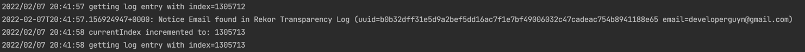

# OSX Guide

Run following command to spin up a running lima instance and tail the falco logs. Root access is required to copy this
project files into the lima shared directory.

## Usage

To start lima with falco installed and configured to run with this plugin, please run command below. This command also
follows the falco logs. You'll see your rule event on here.

> Caution: Don't forget to replace email address in example-rule.yaml with your own email address.

```shell
make lima
```

Now, to trigger the falco alert you should sign a container image with your own email address.

> Caution: Don't forget to replace the image name with your own.

```shell
COSING_EXPERIMENTAL cosign sign devopps/alpine:3.15.0
```

You should see your rule is triggered from the falco logs like the following example.


